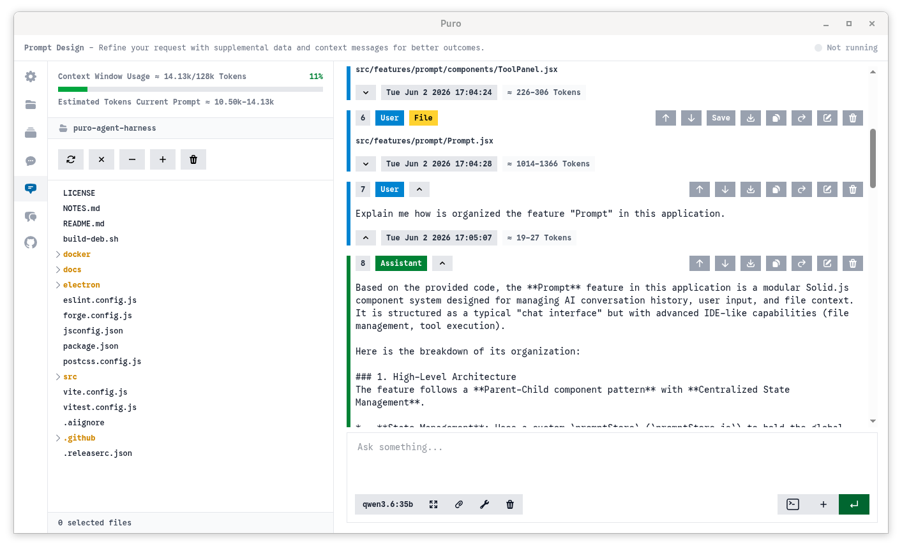

<p align="center">
  
</p>

<h1 align="center">Puro</h1>
<p align="center">
  
  
  
</p>

Puro is an **Open Source Minimal High-Granularity Coding Harness** designed for who demand to stay close to the code and maintain control over its evolution. If you know how to edit the prompt context, you know how to drive the agent.



## Core Principles

- **Precision over Autonomy**: Built on the belief that complex software requires a "human-in-the-loop". Instead of delegating high-level tasks and hoping for the best, prioritizes surgical accuracy through constant human oversight.
- **Zero Hidden Logic**: No black boxes. Every message sent to or received from the LLM is fully visible, ensuring 100% transparency in the communication loop.
- **Total State Sovereignty**: Actively manipulate the entire conversation state and drive the agent's logic, you are the compaction algorithm. Edit everything on the fly, from system prompts and LLM responses to message ordering and rule injection, treating the conversation history as a live, malleable environment, giving you absolute oversight of the agent loop.
- **Small Open-Weight Models First**: The vast majority of coding harnesses are engineered and benchmarked starting from frontier models. Puro is built from the ground up for small open-weight models: if it works reliably for small models, it will perform even better for frontier models.
- **Radical Simplicity**: No MCP, no sub-agents, no "modes", no hidden abstractions. Plans and to-dos live in your files. No sandbox, the agent is strictly confined to your workspace and your direct oversight.
- **Atomic Toolset**: Limited to just three essential tools (*Read File*, *Write File*, and *Execute Bash*) to reduce model confusion and keeps the developer in total control. We deliberately removed "edit" tools because small models often struggle to use them reliably.
- **No plugin system required**: Forget boilerplate. To add a custom tool, just create a script and instruct the agent to call it via Bash. Bash is the only interface you need.
- **No Extension Bloat**: Stop wasting time building extensions. Design your own agentic flow by editing the context and history on the fly. You are the architect of the loop.
- **Open Source**: Licensed under AGPL-3.0.

## Availability & Roadmap

While currently focused on a Linux-first, small models-first experience, we would like to support more environments and providers.

- **Model Providers**: Currently optimized for Ollama to prioritize small open-weight models, we are exploring support for additional providers including premium hosted APIs and Proprietary Cloud APIs (such as OpenAI, Anthropic, and Google).
- **Platform Support**: Native packages are currently available for Linux (.deb and .rpm). Support for macOS and Windows is intended for future releases.

## Features

Puro provides a high-granularity interface for managing the exact context sent to your LLM. Unlike standard chat interfaces, it enables granular control over the entire conversation loop.

- **Context Manipulation**: Full control over the conversation history. Easily include or exclude specific messages, change roles (user, assistant, system, tool), and reorder the conversation sequence to optimize prompt structure.
- **Integrated Workspace & Files**: Browse your local filesystem directly within the app. Select multiple files to instantly inject their contents into your context, or use the "Save" feature to write LLM-generated code directly back to your workspace.
- **Bash in the Context**: Execute Bash commands directly from the conversation. The command and its output are injected straight into the prompt context as discrete messages, allowing you to monitor execution and manipulate the resulting data as part of the conversation history.
- **Transparent Tool Orchestration**: Maintain absolute control over an atomic toolset (*Read Files*, *Write File*, *Execute Bash*) by dynamically enabling or disabling tools to govern agent behavior. Intercept and edit the Bash command directly within the conversation history before execution; once run, the output is injected as a new message, allowing you to further manipulate the results.
- **Token Awareness**: Real-time pre-execution estimation and context window monitoring. Visual progress indicators provide proactive warnings as you approach "context rot" based on your defined limits.
- **Session Management**: Maintain multiple independent workspaces and conversation histories. Create, rename, and switch between sessions within any workspace to organize different tasks and resume progress instantly.
- **Easy Configuration**: Edit configuration via a live JSON editor. Update settings, manage model providers without ever leaving the UI.

**Important Note**: The project is currently in deep development. The core architecture and feature set are evolving rapidly.

## Tech Stack

The stack is intentionally lean. It is built with Solid JS for a high-performance, reactive frontend with near-zero overhead. Electron is stripped to the essentials, used only to ensure UI portability without the "garbage" dependencies of a full-blown suite.

- **Frontend**: Solid JS
- **Desktop Framework**: Electron
- **Styling**: Tailwind CSS v4
- **AI Integration**: Ollama SDK
- **Development Server**: Vite

Please read the [development docs](docs/DEVELOPMENT.md) and [contribution docs](docs/CONTRIBUTING.md) for further details.

## Getting Started

### Prerequisites

Before you begin, ensure you have the following installed:

- **Node.js**: Version 22.x or higher.
- **Ollama**: Installed and active (either locally or via a remote endpoint) for model inference.

### Installation & Setup

- Clone the repository and navigate into the project directory.
- Then:

```bash
# Install dependencies
npm install

# Launch the application
npm run electron
```

For comprehensive build instructions and production packaging details, please refer to the [DEVELOPMENT.md](docs/DEVELOPMENT.md) guide.

## License

This project is licensed under the **AGPL-3.0-only** license. You are free to use, modify, and distribute it, provided that you also make your derivative works open source.

See [LICENSE](LICENSE) for more details.

## Contributing

Contributions are welcome! Please feel free to submit a Pull Request or open an issue for bugs and feature requests (please read the [contribution docs](CONTRIBUTING.md) for further details).

*Made with ❤️ in Europe*